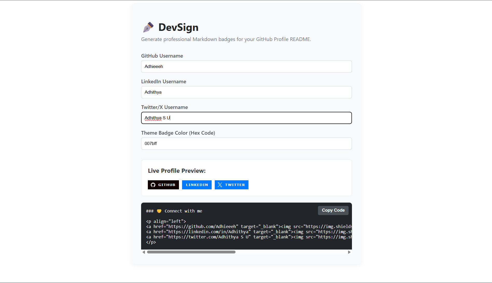

## DevSign — GitHub Badge Generator ##
---------------------------------------

## React Projects

DevSign is a minimalist, interactive web utility built with React that helps developers quickly generate professional Markdown badges for their GitHub Profile READMEs. Instead of writing complex HTML or Markdown strings manually, simply plug in your usernames, pick a color, and copy the code!


##  Live Preview Image



##  Features
*  **Real-Time Preview:** Watch your social badges change instantly as you type.
*  **Custom Themes:** Change badge backgrounds using simple Hex color codes.
*  **One-Click Copy:** Easily grab the perfectly formatted Markdown code block for your GitHub profile.
*  **Responsive Design:** Clean and minimalist interface.

---

##  Tech Stack
* **Frontend Library:** React (v18+)
* **Build Tool:** Vite (for ultra-fast development)
* **Badges API:** Shields.io

---

##  How to Run Locally

Follow these steps to get the project running on your local machine:

    1. **Clone the repository:**
       ```bash
       git clone [https://github.com/Adhieeeh/devsign-generator.git](https://github.com/Adhieeeh/devsign-generator.git)
    2.Navigate into the project directory:
    
          cd devsign-generator
          
    3.Install dependencies:
    
            npm install
    
    4.Start the development server:
    
            npm run dev
    
    5. Open http://localhost:5173 in your browser to see the application running!


            
